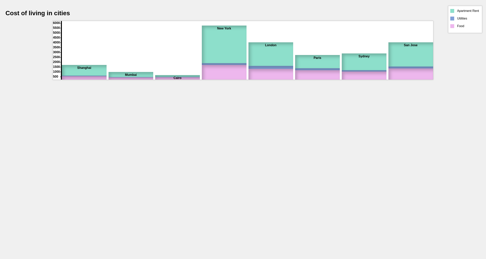

# stacked-bar-chart
A React.js-based data visualization package to plot stacked bar charts.

Dataset used: Global Cost of Living dataset from Kaggle  
https://www.kaggle.com/datasets/mvieira101/global-cost-of-living?datasetId=2687424&sortBy=voteCount 
The data consists of cost of living information of about 5000 cities around the world.  
I am using the below columns from the csv file to calculate the total living expense in a city:  
- x1 	Meal, Inexpensive Restaurant (USD)  
- x48 	Apartment (1 bedroom) in City Centre (USD)  
- x36 	Basic (Electricity, Heating, Cooling, Water, Garbage) for 85m2 Apartment (USD)  

The csv file is converted to a JSON file and read using fetch() method of JS and a stacked bar-chart is plotted by calculating the height of individual bars.

Visualization can be accessed here:  
https://saumyasucharita.github.io/stacked-bar-chart/

